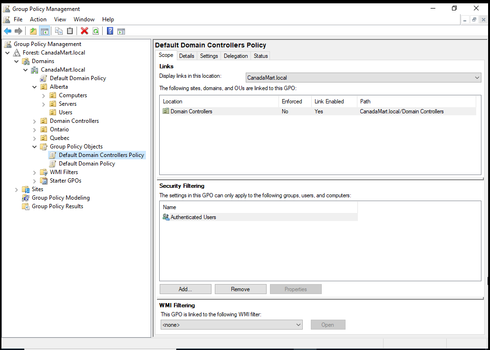
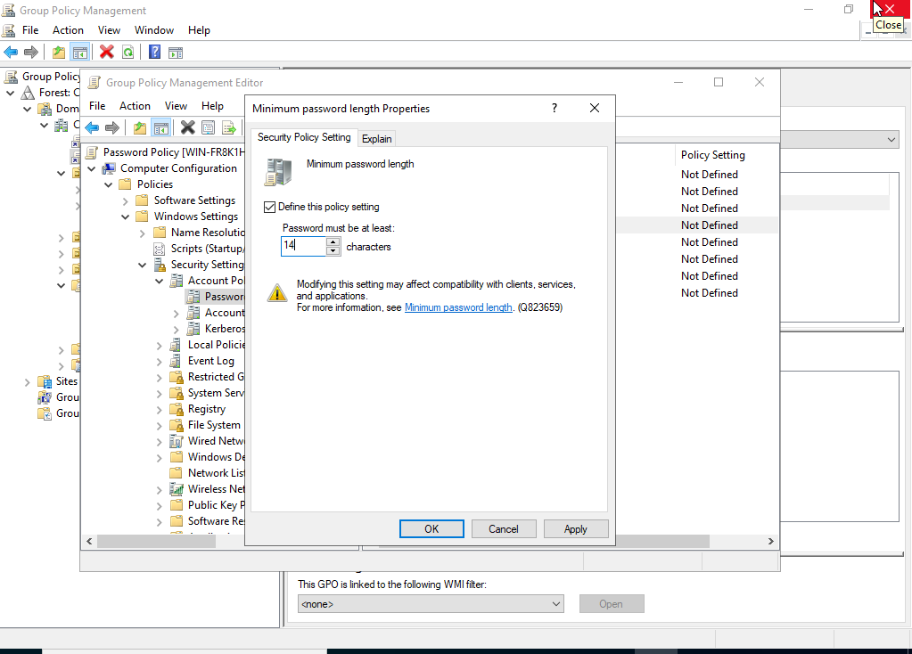
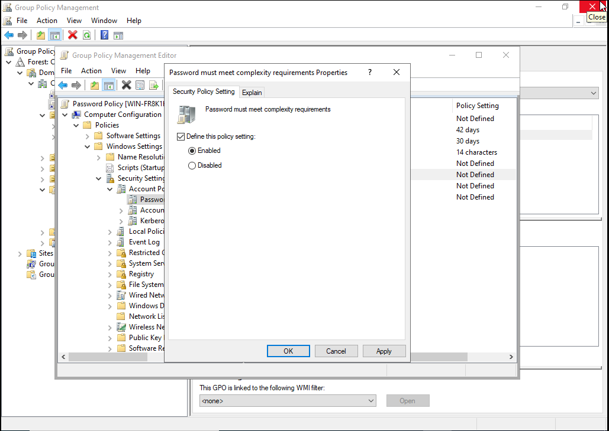
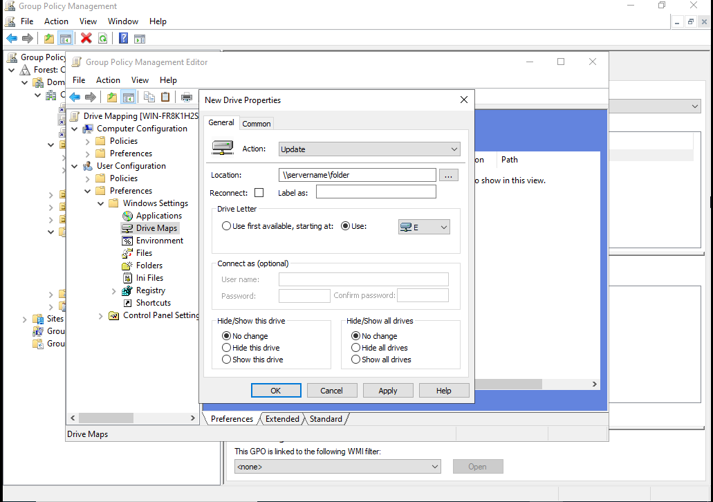
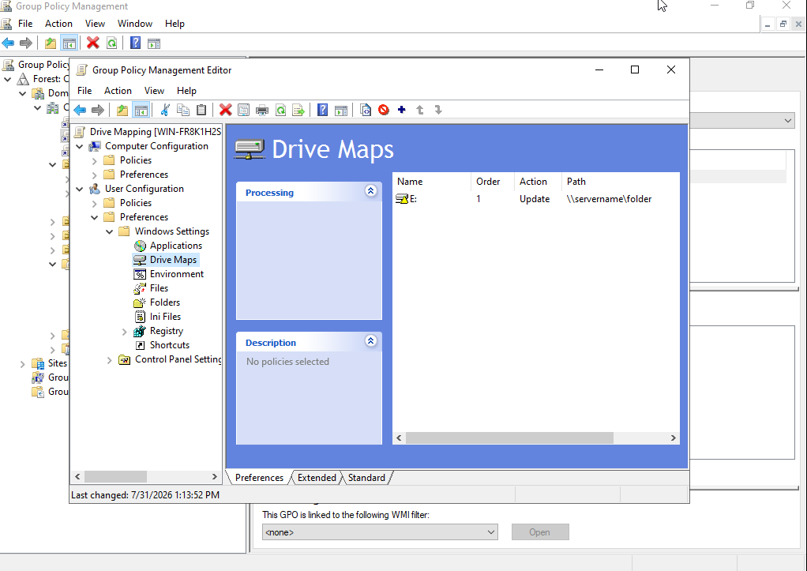
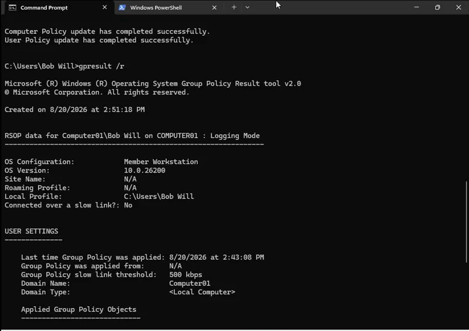
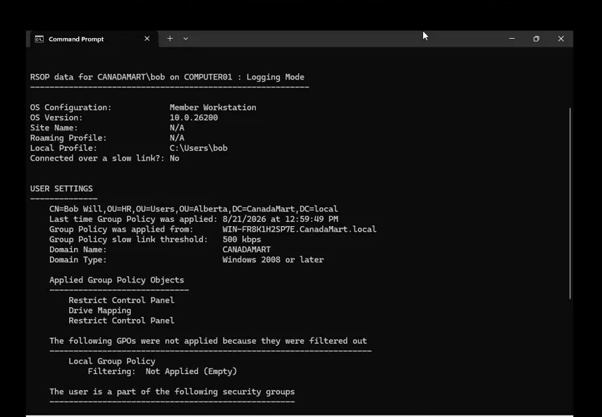
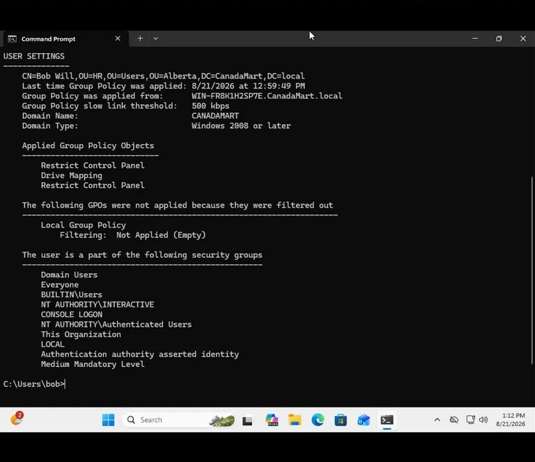
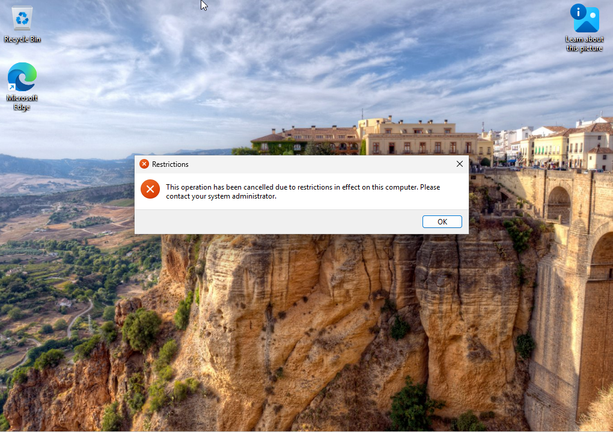

# Active Directory Home Lab: CanadaMart.local

A hands-on Windows Server 2022 lab where I built an Active Directory domain for a fictional retailer, **CanadaMart**, organized it by province, and used Group Policy to enforce security settings on users and computers. I then joined a Windows 11 client to the domain, tested every GPO, and troubleshot a real issue where policies weren't applying.



## Skills Demonstrated

- Installing and configuring **Active Directory Domain Services (AD DS)** and **DNS** on Windows Server 2022
- Designing an **Organizational Unit (OU)** hierarchy and creating users, security groups, and distribution groups
- Creating, editing, and linking **Group Policy Objects (GPOs)** with the Group Policy Management Console
- Choosing correctly between **Computer vs. User Configuration** and **Policies vs. Preferences**
- Static IP / DNS configuration for a domain controller and **joining a Windows 11 Pro client** to the domain
- Troubleshooting with `ipconfig`, `ping`, `gpupdate /force`, and `gpresult /r`

## Lab Environment

| Component | Details |
|---|---|
| Domain controller | Windows Server 2022 (VM) — AD DS, DNS, Group Policy Management |
| Domain | `CanadaMart.local` |
| Server IP | `192.168.233.140` (static), gateway `192.168.233.2`, preferred DNS `127.0.0.1` |
| Client | Windows 11 Pro (`COMPUTER01`), DHCP address `192.168.233.141`, DNS pointed at the DC |
| Test accounts | `bob@CanadaMart.local` (standard user), `rafi@CanadaMart.local` (Domain Admin) |

> **Note:** Only Windows 11 **Pro** and **Enterprise** can join a domain. Windows 11 Home cannot.

## Directory Structure

```
CanadaMart.local
├── Alberta
│   ├── Computers        ← COMPUTER01
│   ├── Servers
│   └── Users
│       └── HR           ← Bob Will
├── Ontario
│   ├── Computers
│   ├── Servers
│   └── Users
└── Quebec
    ├── Computers
    ├── Servers
    └── Users
```

Groups created under `Alberta > Users`:

- **IT** — security group (used to assign permissions)
- **DL-ITAdmins** — distribution group (used for bulk email)

## Group Policy Objects

| GPO | Configuration | Type | Linked to |
|---|---|---|---|
| Password Policy | Computer | Policy | Domain root |
| Drive Mapping | User | Preference | Domain root |
| Desktop Wallpaper | User | Policy | Domain root |
| Restrict Control Panel | User | Policy | Domain root, `Alberta > Users` |
| Disable USB Devices | Computer | Policy | `Alberta > Computers` |

### Key concepts behind these choices

**Computer vs. User Configuration.** Computer settings apply to the machine no matter who logs in. User settings follow the person to whatever machine they log into. The test I use: *if a more trusted person logged into this exact machine, should the restriction still apply?* If yes, it's Computer Configuration (like blocking USB storage on a finance PC). If no, it's User Configuration (like blocking Control Panel, which IT staff still need when troubleshooting that same PC).

**Policies vs. Preferences.** Policies are enforced by administrators and users can't change them (password rules, lockouts). Preferences set a default that users can change later (mapped drives, printers, shortcuts).

### 1. Password Policy

`Computer Configuration > Policies > Windows Settings > Security Settings > Account Policies > Password Policy`

| Setting | Value |
|---|---|
| Minimum password length | 14 characters |
| Password must meet complexity requirements | Enabled |
| Minimum password age | 30 days |
| Maximum password age | 42 days |

**Why 14 characters?** Microsoft's default of 7 is outdated, and the CIS Benchmark recommends 14 for domain accounts. Password strength grows roughly exponentially with length, and NIST SP 800-63B favors length over forced complexity, since complexity rules push people toward predictable patterns like `Password1!`. I stopped at 14 rather than 20+ to balance security with usability, because very long minimums make people more likely to write passwords down or reuse them.

<p float="left">
  
  
</p>

### 2. Drive Mapping

`User Configuration > Preferences > Windows Settings > Drive Maps > New > Mapped Drive`

Automatically maps a shared folder (`\\servername\folder`) to drive **E:** when a user logs in. This is a User Configuration **preference** because it's user-specific and the user can change it later.

<p float="left">
  
  
</p>

### 3. Desktop Wallpaper

`User Configuration > Policies > Administrative Templates > Desktop > Desktop > Desktop Wallpaper`

Sets a standard wallpaper at logon. It's a **policy** so users can't change it. The wallpaper path field must have a value or the setting won't apply.

### 4. Restrict Control Panel

`User Configuration > Policies > Administrative Templates > Control Panel > Prohibit access to Control Panel and PC settings` → **Enabled**

### 5. Disable USB Storage

`Computer Configuration > Policies > Administrative Templates > System > Removable Storage Access > All Removable Storage classes: Deny all access` → **Enabled**

## Joining the Client to the Domain

1. **Server:** set a static IPv4 address with preferred DNS `127.0.0.1` (the DC is its own DNS server). Servers use static IPs by convention.
2. **Client:** leave IP assignment on automatic (DHCP), but set the preferred DNS server manually to the domain controller's IP.
3. Confirm connectivity by pinging the server from the client.
4. On the client: `Settings > System > About > Domain or workgroup` → join `CanadaMart.local` using a Domain Admin account.
5. In **Active Directory Users and Computers**, refresh and move `COMPUTER01` from the default `Computers` container into `Alberta > Computers`.

**Why step 5 matters:** joining the domain only lets the computer authenticate with the server. It doesn't receive any Alberta-specific GPOs until it's actually placed in the Alberta OU. It's like a new employee who has a building badge but hasn't been assigned to a department yet.

## Testing and Troubleshooting

### Problem: Control Panel was still accessible

After linking the GPOs, I logged in as Bob Will on `COMPUTER01` and could still open Control Panel.

**Step 1: Force a policy refresh.** Windows refreshes Group Policy about every 90 minutes by default, so I ran `gpupdate /force` on the client. It still didn't work.

**Step 2: Check the resulting policy with `gpresult /r`.** This revealed the real root cause:



- The session was `Computer01\Bob Will`, not `CANADAMART\bob`
- Domain Type was `<Local Computer>`
- Applied Group Policy Objects: **N/A**, and no domain security groups

Bob was logged in with a **local account** that happened to have a similar name, not his domain account. Local accounts have no relationship to AD, so no domain GPOs applied at all.

**Fix:** sign in explicitly with the domain identity, `bob@CanadaMart.local`.

### Result

`gpresult /r` now shows `CANADAMART\bob`, the correct domain, and the applied GPOs:

<p float="left">
  
  
</p>

*Restrict Control Panel* appears twice because the same GPO is linked in two places (domain root and `Alberta > Users`), and both links apply to Bob. That's expected, not an error.

Opening Control Panel is now blocked:



## Lessons Learned

- **Always verify with `gpresult /r` before assuming a GPO is broken.** `gpupdate /force` can't fix a problem that isn't about timing.
- **Local accounts and domain accounts can look alike.** Signing in as `DOMAIN\user` or `user@domain` removes the ambiguity.
- **Joining the domain isn't the last step.** Computers and users must sit in the right OU for targeted GPOs to reach them.
- **Put each setting where it belongs.** Choosing Computer vs. User and Policy vs. Preference correctly decides who a setting affects and whether they can undo it.
